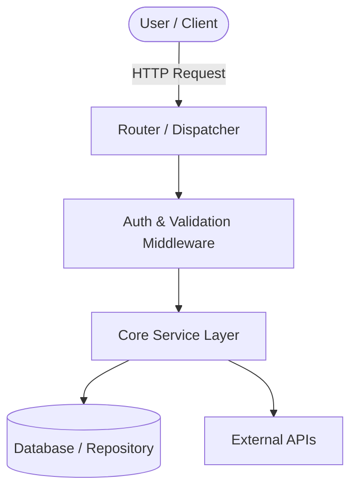

# Codebase Analysis Techniques

## Mermaid Architecture Template

```mermaid
flowchart TD
    User([User / Client]) -->|HTTP Request| Router[Router / Dispatcher]
    Router --> Middleware[Auth & Validation Middleware]
    Middleware --> Service[Core Service Layer]
    Service --> Repo[(Database / Repository)]
    Service --> External[External APIs]
```
